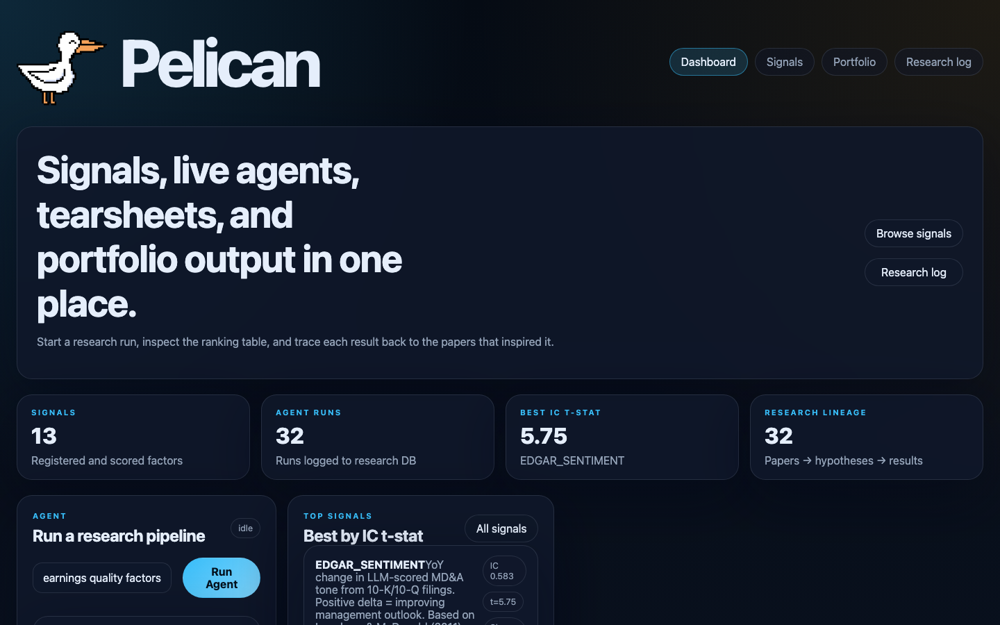
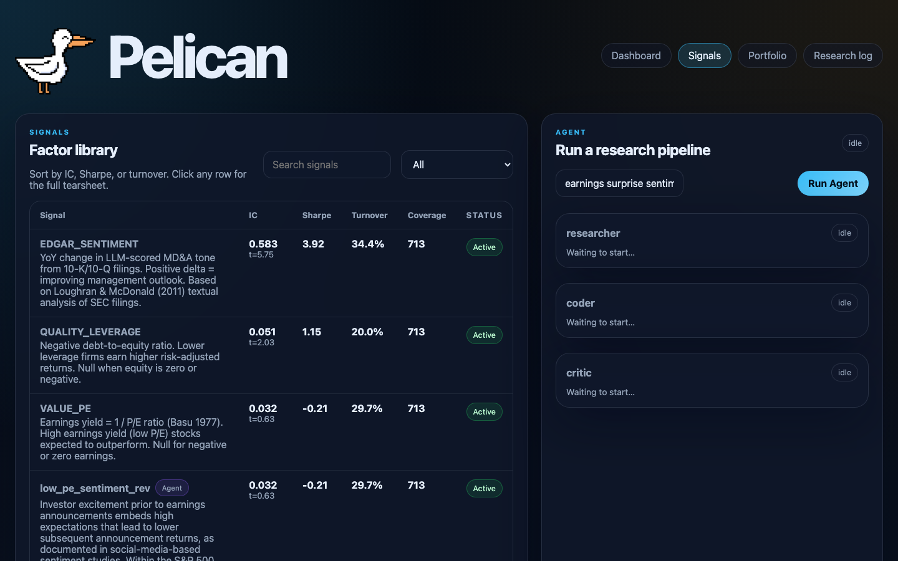
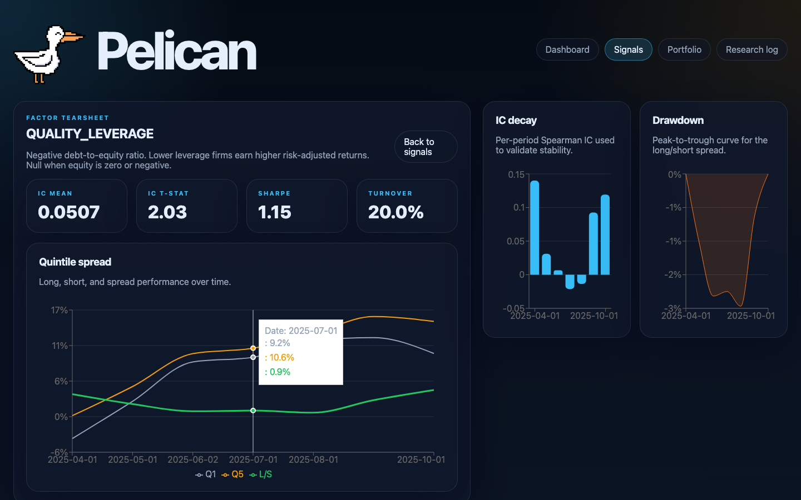
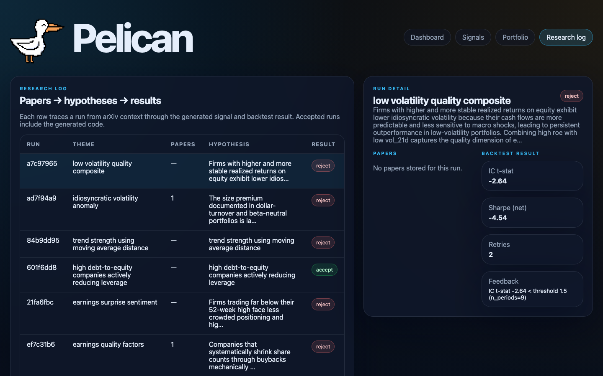
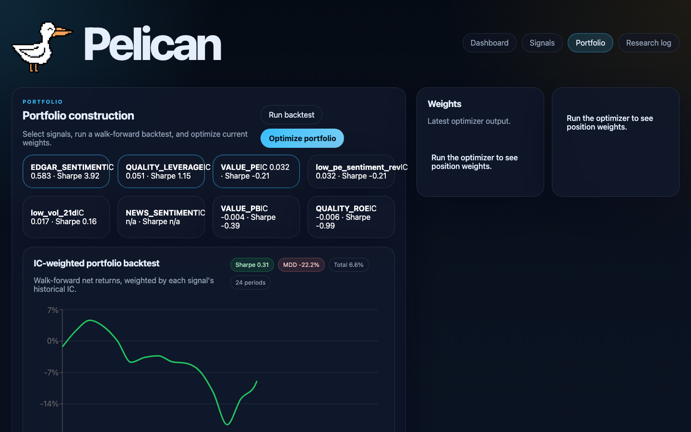

# Pelican

An agentic factor research platform. LLM agents autonomously discover, implement, and backtest quantitative alpha signals from academic literature. Accepted signals feed a risk-aware portfolio optimizer. A FastAPI + React dashboard lets you browse signals, inspect backtest tearsheets, run a walk-forward portfolio backtest, and monitor the agent pipeline live.

---

## Screenshots

### Dashboard
Overview of registered signals, agent runs, top performers by IC t-stat, and a quick-launch agent panel.



### Factor Library
Full signal table sortable by Sharpe, IC, or turnover. Agent-discovered signals carry a purple **Agent** badge. Signals with fewer than 50 tickers scored show a **Sparse data** warning. Click any row to open its tearsheet.



### Signal Tearsheet — QUALITY_LEVERAGE
Per-period IC decay, drawdown curve, and quintile spread equity curve for each registered factor.



### Research Log
Full lineage for every agent run — papers fetched from arXiv, the generated hypothesis, the produced signal code, and the backtest verdict.



### Portfolio Construction
Select signals, run the IC-weighted walk-forward backtest, and optimize current weights with the CVXPy mean-variance solver.



---

## Quickstart

```bash
# 1. Clone and install
git clone https://github.com/your-org/pelican
cd pelican
pip install -e ".[dev]"

# 2. Configure
cp .env.example .env
# Required: OPENROUTER_API_KEY, DUCKDB_PATH, DATA_DIR
```

Get a free API key at [openrouter.ai](https://openrouter.ai). The default model (`meta-llama/llama-3.3-70b-instruct:free`) is free with no rate-limit fees.

```bash
# 3. Seed data (~30 min, ~10 GB — prices first, then fundamentals)
python scripts/seed_data.py
python scripts/seed_fundamentals.py

# 4. Optional: seed alternative data
python scripts/seed_edgar.py          # SEC MD&A tone scoring via LLM
python scripts/seed_news.py           # News headline sentiment via LLM

# 5. Start the API server
uvicorn pelican.api.main:app --reload        # http://localhost:8000

# 6. Start the frontend (separate terminal)
cd frontend && npm install && npm run dev    # http://localhost:5173
```

---

## Running the Agent

### From the dashboard (recommended)

1. Open `http://localhost:5173`
2. Type a research theme in the **Run a research pipeline** panel — e.g. `earnings quality factors` or `low volatility anomaly`
3. Click **Run Agent**
4. Watch the researcher, coder, and critic nodes stream live in the right panel
5. On accept, the signal is immediately added to the **Factor Library** and visible on the Signals page

### From the terminal

```bash
python scripts/run_agent.py --theme "earnings quality factors"

# Skip the arXiv researcher (uses theme directly as signal description)
python scripts/run_agent.py --theme "12-1 month momentum" --no-research
```

### Good themes to try

| Theme | What the agent typically discovers |
|---|---|
| `earnings quality factors` | Accruals, cash-flow-to-price, earnings persistence |
| `low volatility anomaly` | Negative realized vol, min-variance tilt |
| `value investing pe ratio` | Earnings yield, negative P/E rank |
| `price momentum 12 month` | 12-1 momentum, intermediate-horizon continuation |
| `short-term reversal` | 1-month reversal, liquidity provision premium |
| `quality profitability` | ROE, gross profit margin, asset turnover |
| `52-week high momentum` | Distance from 52-week high as an anchor signal |
| `sentiment earnings announcements` | Post-earnings drift, analyst revision breadth |
| `news sentiment and price reaction` | Headline tone, earnings surprise, analyst revision |

---

## How It Works

```
Research Theme
      │
      ▼
┌─────────────────────────────────────────────────────────────────┐
│  RESEARCHER — searches arXiv for relevant papers, extracts up   │
│  to 3 distinct signal hypotheses with economic rationale and    │
│  specific data columns; avoids duplicating existing signals     │
└───────────────────────────┬─────────────────────────────────────┘
                            │ hypothesis + citations
                            ▼
┌─────────────────────────────────────────────────────────────────┐
│  CODER — translates hypothesis into a validated                 │
│  compute_signal(df: pl.DataFrame) -> pl.Series function;        │
│  sandboxed exec rejects disallowed imports and look-ahead bias  │
└───────────────────────────┬─────────────────────────────────────┘
                            │ generated code
                            ▼
┌─────────────────────────────────────────────────────────────────┐
│  CRITIC — runs a real 3-year point-in-time backtest, checks     │
│  IC t-stat ≥ 1.5 and net Sharpe ≥ 0.3; returns accept or       │
│  reject with written feedback                                   │
└────────┬──────────────────┴──────────────────────┬─────────────┘
         │ reject (up to 2 retries,                │ accept
         │ next hypothesis each cycle)             ▼
         └──────────► RESEARCHER (retry)  Signal added to registry
                                          + investment memo written
                                          + persisted to DuckDB
```

The graph is a LangGraph state machine. Each node is a pure `(State) -> State` function; the Critic's conditional edge drives the retry loop. On retry, the Coder picks the next hypothesis in sequence so each attempt tries a genuinely different economic mechanism.

---

## Architecture

```
pelican/
├── pelican/
│   ├── agents/         # LangGraph graph, researcher/coder/critic/reporter nodes
│   │   ├── prompts/    # system prompts (researcher.md, coder.md, reporter.md)
│   │   └── tools/      # arXiv search, ChromaDB deduplication, sandbox exec
│   ├── backtest/       # vectorized Polars engine, signal registry, metrics
│   ├── data/           # DuckDB store, price/fundamental/EDGAR/news ingestion
│   ├── factors/        # 8 hand-coded factors + EDGAR_SENTIMENT + NEWS_SENTIMENT
│   ├── portfolio/      # CVXPy optimizer, Ledoit-Wolf risk model, signal combiner
│   ├── api/            # FastAPI app + SSE streaming router
│   └── utils/          # pydantic-settings config, structured logging
├── frontend/           # React 18 + Vite + TypeScript + Recharts dashboard
├── scripts/            # seed_data.py, seed_edgar.py, seed_news.py, run_agent.py
└── tests/              # pytest suite (~361 tests, fully mocked LLM/HTTP)
```

### Data layer

Single DuckDB file. Five core tables:

| Table | Contents |
|---|---|
| `sp500_universe` | Survivorship-bias-free S&P 500 membership history |
| `prices` | Daily OHLCV + `log_return_1d`, `forward_return_21d` |
| `fundamentals` | Quarterly ratios with `available_date = period_end + 45d` (point-in-time anchor) |
| `edgar_sentiment` | LLM-scored MD&A tone per (ticker, filing_date, filing_type); YoY delta pre-computed |
| `news_sentiment` | Daily per-ticker headline sentiment averaged across LLM-scored articles |
| `research_log` | Full lineage for every agent run (papers, hypothesis, code, metrics) |

### Factor library

Ten registered signals across four families:

| Signal | Family | Description |
|---|---|---|
| `MOM_1_12` | Momentum | 12-1 month price momentum (Jegadeesh & Titman 1993) |
| `REVERSAL_1M` | Reversal | 1-month short-term reversal (Lo & MacKinlay 1990) |
| `LOW_VOL` | Risk | Low realized volatility (Baker et al. 2011) |
| `SIZE` | Fundamental | Log market cap (Fama & French 1992) |
| `VALUE_PE` | Fundamental | Earnings yield (negative P/E rank) |
| `VALUE_PB` | Fundamental | Book-to-market ratio |
| `QUALITY_ROE` | Fundamental | Return on equity (Novy-Marx 2013) |
| `QUALITY_LEVERAGE` | Fundamental | Negative debt-to-equity (lower leverage = higher quality) |
| `EDGAR_SENTIMENT` | Alternative | YoY MD&A tone shift from SEC 10-K/10-Q filings |
| `NEWS_SENTIMENT` | Alternative | Daily headline sentiment from news articles |

### Backtest engine

Fully vectorized over a Polars `(date × ticker)` panel. Monthly rebalance (21-day hold) over a 3-year window (~36 periods). Per rebalance date: queries point-in-time universe, joins fundamentals (`available_date ≤ rebalance_date`), EDGAR sentiment, and news sentiment; builds cross-section features (lagged closes, rolling vols); computes signal scores; cross-sectional rank → z-score; forms Q5 (long) vs Q1 (short) equal-weighted quintile portfolios; measures 21-day forward returns.

Transaction costs use an Almgren-Chriss two-parameter model: `cost = (turnover × spread_bps + turnover^1.5 × impact_bps) / 10_000`. The super-linear impact term penalizes high-turnover strategies more than flat-bps models.

### Signal registry

All signals — hand-coded and agent-discovered — live in an in-process `_REGISTRY` dict. Hand-coded signals register via `@register(SignalSpec(...))` at import time. Agent signals are compiled and inserted by `register_dynamic()` the moment they're accepted, and reloaded from `research_log` on server restart via `load_dynamic_signals()`.

### Portfolio construction

Two-stage pipeline:

1. **Backtest** (`POST /portfolio/backtest`) — walks forward over all historical rebalance dates, IC-weights each signal's L/S net returns, and returns a cumulative equity curve with Sharpe, max drawdown, and total return.
2. **Optimize** (`POST /portfolio/optimize`) — solves a CVXPy mean-variance QP at a single rebalance date: dollar-neutral (`sum(w)=0`), gross long = 1, gross short = −1, per-stock cap 5%. Covariance from Ledoit-Wolf shrinkage over 252-day daily returns. Risk decomposition into systematic (PCA factor) and idiosyncratic components.

### SSE streaming

The agent pipeline runs in a thread executor. Events (`node_start`, `llm_token`, `node_complete`, `run_complete`) are pushed into an `asyncio.Queue` and drained by the SSE handler. The React frontend connects via `EventSource` and renders each node's state as it arrives.

---

## Tech Stack

| Layer | Technology |
|---|---|
| Language | Python 3.11+ |
| Agent orchestration | LangGraph + LangChain |
| LLM | OpenRouter — `meta-llama/llama-3.3-70b-instruct:free` |
| DataFrame engine | Polars |
| Storage | DuckDB |
| Vector store | ChromaDB (paper deduplication) |
| Price + fundamental data | yfinance |
| Alternative data | SEC EDGAR API (no key), yfinance news |
| Portfolio optimization | CVXPy (CLARABEL/OSQP) |
| API server | FastAPI + Uvicorn |
| Frontend | React 18, Vite, TypeScript, Recharts |
| Testing | pytest (~361 tests) |

---

## Key Design Decisions

**Point-in-time correctness** — every join in the backtest engine uses `available_date ≤ rebalance_date` to anchor fundamentals, `filing_date ≤ rebalance_date` for EDGAR/news data, and `entry_date / exit_date` for universe membership. No look-ahead bias by construction.

**Sandboxed code execution** — LLM-generated signal code runs in a restricted namespace (allowlisted imports: `polars`, `numpy`, `math` only). The executor also validates output shape, dtype, null rate, and absence of `inf`/`nan`.

**Signal acceptance gate** — the Critic enforces IC t-stat ≥ 1.5 and net L/S Sharpe ≥ 0.3 over a 3-year window (~36 monthly periods). At 36 periods, IC t-stat ≥ 1.5 requires a real ICIR ≥ 0.25, a meaningful statistical bar.

**Multi-hypothesis retry** — the Researcher generates 3 distinct signal hypotheses per arXiv search. On critic rejection, the Coder picks the next hypothesis in sequence so each retry cycle explores a different economic mechanism rather than rephrasing the same idea.

**Registry deduplication** — existing signal names are passed into every researcher prompt so the LLM avoids re-proposing signals already in the registry.

**Almgren-Chriss cost model** — transaction costs decompose into spread (linear in turnover) and market impact (scales as `turnover^1.5`). High-turnover strategies are penalized more than they would be under a flat-bps model, which is empirically more accurate for equity L/S.

**Sparse data warnings** — signals computed on fewer than 50 tickers (e.g. partially-seeded alternative data) show a **Sparse data** chip in the UI rather than the normal **Active** chip, making statistical unreliability explicit.
